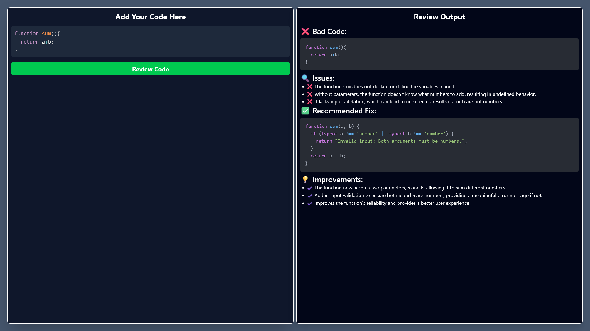

# AI Code Review – Full-Stack Application



## Overview

The AI Code Review project is a full-stack web application that helps developers review their code using AI-powered analysis. Built with Node.js, Express.js, MongoDB, React.js, and TailwindCSS, this application allows users to submit their code and receive **detailed feedback on issues, improvements, and suggested fixes.**

## 🚀 Features

-   **Submit Code for AI Review** – Upload code snippets for AI-driven analysis.
-   **Detailed Feedback** – Identify syntax issues, logical errors, and best practice violations.
-   **Performance Optimization Tips** – AI suggestions for improved efficiency and maintainability.
-   **Syntax & Best Practices Analysis** – Helps enhance code quality and readability.

## 🏗️ Technologies Used

-   Backend: Node.js, Express.js.
-   Frontend: ReactJs, TailwindCSS
-   AI Integration: Gemini AI (for code analysis and recommendations)

## Installation

### 🔹Frontend Setup

1. Navigate to the `frontend` directory:

    ```bash
    cd frontend
    ```

2. Install dependencies:

    ```bash
    yarn
    ```

3. Set up environment variables:

    ```bash
    cp .env.sample .env
    ```

    Update the `.env` file with your Backend API URL and other required credentials.

4. Start the frontend server:
    ```bash
    yarn start
    ```
    The frontend should be accessible at `http://localhost:5173`.

---

### 🔹Backend Setup

1. Navigate to the `backend` directory:
    ```bash
    cd ../backend
    ```
2. Install dependencies:
    ```bash
    yarn
    ```
3. Set up environment variables:

    ```bash
    cp .env.sample .env
    ```

    Update `.env` file with your credentials.

4. Start the backend server:
    ```bash
    npm run dev
    ```
    The backend should be accessible at `http://localhost:8000`.

## Usage

### 1. Submitting Code for Review

-   Navigate to the Home Page and paste your JavaScript code into the input field.
-   Click on the **"Review Code"** button.
-   The AI will analyze the code and provide:
    -   Bad Code Section – Highlights issues in the submitted code.
    -   Issues & Fixes – Explains problems and suggests AI-generated fixes.
    -   Improvements – Lists best practices and optimization suggestions.

### 2. Understanding Review Output

-   The AI review consists of three sections:
    -   🚨 **Issues:** Points out errors like syntax mistakes, security vulnerabilities, or missing declarations.
    -   ✅ **Recommended Fixes:** AI-generated improved version of the submitted code.
        -💡 **Improvements:** Suggestions to enhance efficiency, maintainability, and readability.

## Development & Contribution

### Steps to Contribute

1. Clone the repository:
    ```bash
    git clone https://github.com/ma3llim007/ai-code-review.git
    ```
2. Create a new branch:
    ```bash
    git checkout -b feature/your-feature-name
    ```
3. Implement your changes and commit:
    ```bash
    git add .
    git commit -m "Describe your changes here"
    ```
4. Push to GitHub:
    ```bash
    git push origin feature/your-feature-name
    ```
5. Open a pull request on GitHub and describe your changes.

## Contribution Guidelines

-   Follow the project structure and best practices.
-   Write clean, modular, and well-documented code.
-   Ensure all features are properly tested before submitting PRs.
-   Use GitHub Issues to report bugs and suggest enhancements.

## License

This project is licensed under the MIT License - see the [LICENSE](LICENSE) file for details.

## Acknowledgements

-   **React.js** – Scalable and flexible frontend development.
-   **TailwindCSS** – For efficient and modern UI styling.
-   **Express.js** – Lightweight and robust backend framework.
-   **Gemini AI API** – AI-powered code analysis and recommendations.
